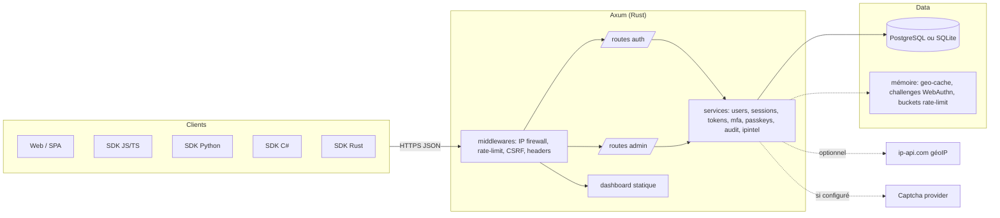
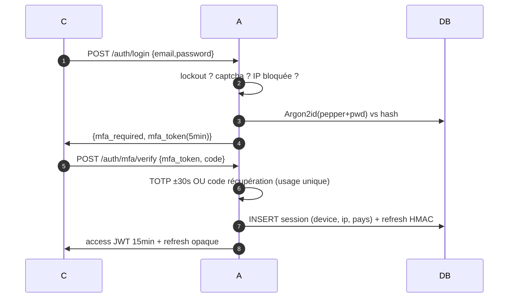
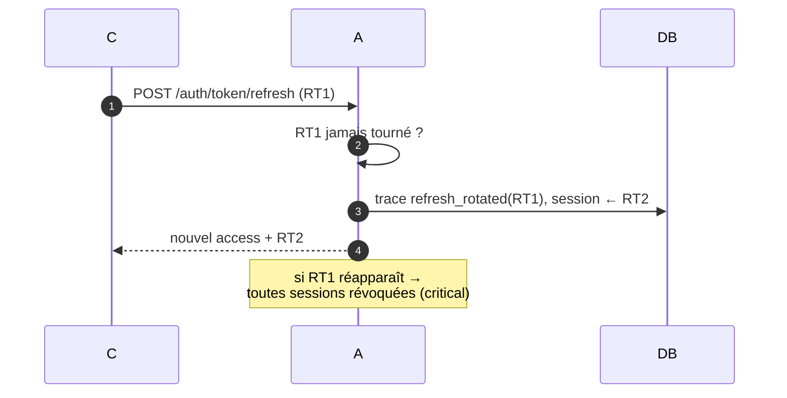
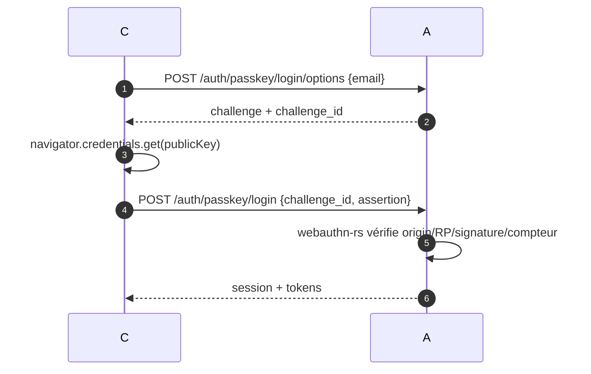

# Architecture — Secure-Login

## Vue d'ensemble



## Schéma de données (ER)

```mermaid
erDiagram
    USERS ||--o{ SESSIONS : possède
    USERS ||--o{ TOKENS : reçoit
    USERS ||--o{ PASSKEYS : enregistre
    USERS ||--|| MFA : active
    USERS ||--o{ SECURITY_LOGS : génère
    LOGIN_ATTEMPTS }o..|| BLOCKED_IPS : "ip"

    USERS {
        text id PK
        text email UK_lower
        text password_hash "Argon2id+pepper"
        text salt
        bool email_verified
        text role "user|admin|owner"
        datetime last_login_at
        text last_login_ip
    }
    SESSIONS {
        text id PK
        text user_id FK
        text refresh_hash "HMAC"
        text device
        text fingerprint
        text ip
        text country
        bool revoked
    }
    TOKENS {
        text id PK
        text user_id FK
        text kind "email_verify|pw_reset|refresh_rotated"
        text value_hash UK
        datetime expires_at
        datetime used_at
    }
    BLOCKED_IPS {
        text ip UK
        text mode "blacklist|whitelist"
        datetime expires_at
    }
    PASSKEYS {
        text id PK
        text credential_id UK
        text public_key_enc "AES-GCM"
        bigint counter
    }
    MFA {
        text user_id PK_FK
        text secret_enc "AES-GCM"
        bool enabled
        text recovery_codes_enc "AES-GCM"
    }
    SECURITY_LOGS {
        text event
        text severity "info|warn|critical"
        text details_enc "AES-GCM"
        datetime created_at
    }
    LOGIN_ATTEMPTS {
        text email
        text ip
        bool success
        datetime created_at
    }
```

## Flux de connexion (avec MFA)



## Rotation du refresh token & anti-replay



## Passkeys


